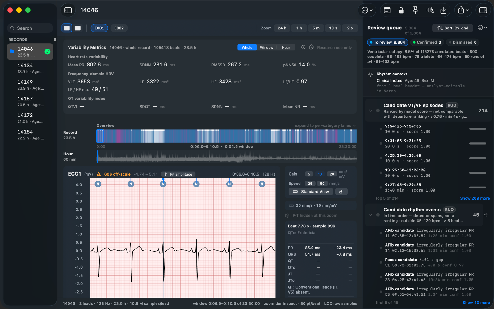

# Murmur Studio

[](https://doi.org/10.5281/zenodo.21077528)

A free, open-source native macOS viewer for PhysioNet WFDB recordings —
a microscope and a telescope for ECG waveform data — with the paid
**Murmur Pro** analysis instruments on top.

<a href="https://apps.apple.com/us/app/murmur-studio/id6782092325?itsct=apps_box_badge&itscg=30200">
  
</a>

Murmur renders WFDB ECG + multi-rate telemetry on a calibrated,
Metal-backed paper canvas and ranges from the whole multi-hour record
down to a single beat. Findings reach the canvas from the record's own
annotator layer, from the in-app arrhythmia scan (Murmur Pro), or from
external producers via a JSON schema. The analyst disposition workflow
— confirm / dismiss / reset — is part of the free viewer, so triage
stays free regardless of where findings came from.



## Open-core distribution

Murmur Studio ships as a single binary on the Mac App Store. The viewer
is free, MIT-licensed, and open-source. One in-app purchase — **Murmur
Pro** — unlocks the analysis instruments, current and future, never
gating anything the free viewer already does.

| Tier | What it does | Source |
|---|---|---|
| **Murmur Studio** (free, MIT) | WFDB import, calibrated paper, annotation layers, filter chips, viewport, disposition workflow, exports | This repo |
| **Murmur Pro** (one purchase) | Beat calipers and interval trends (PR/QRS/QT/QTc with calibrated uncertainty), HRV and QT-variability metrics, whole-record trend lanes, on-device VT/VF + rhythm-event scan (RUO), morphology clustering, annotation authoring | Private frameworks (`kvnlng/Murmur-Extensions`) |

The split is *source distribution*, not *binary distribution*: the App
Store ships one app, and the Murmur Pro entitlement unlocks the paid
frameworks at runtime.

## Status

**Live on the Mac App Store** (v1.3) —
[Murmur Studio](https://apps.apple.com/us/app/murmur-studio/id6782092325).

The free viewer targets macOS 26+ with Swift 6 and Metal.

## Features

- **WFDB ingest** — formats 16 and 212 (MIT-BIH decodes out of the
  box) plus multi-frequency records with per-signal `.dat` files.
  Folder picker covers `.hea` + sibling `.dat` / `.atr` /
  `.annotations.json`.
- **Findings panel** — right-side inspector with category, source,
  and confidence filter chips. Filter is shared with the canvas:
  filtered-out findings stop rendering everywhere.
- **Analyst disposition workflow** — confirm / dismiss / reset on
  each finding, persisted to a versioned sidecar at
  `<bundle>/dispositions.json` so re-running upstream analysis never
  overwrites analyst work.
- **Metal-rendered waveform** — `MTKView` via `NSViewRepresentable`.
  Buffer-per-channel uploaded once; pan/zoom updates a uniforms
  block only. 4× MSAA, LOD crossfade, hover crosshair with live
  cursor tracking and rubber-band overscroll at recording
  boundaries.
- **ECG paper styling** — adaptive grid density that stays readable
  from a 1-second window up to multi-hour viewports.
- **Min/max pyramid + LOD selection** — single-pass at import time.
  The renderer picks raw samples when zoomed in, an instanced-quad
  envelope when zoomed out.
- **Memory-mapped storage** — Float32 channel files + Float64
  pyramid bins via `Data(contentsOf:options:.mappedIfSafe)`.
- **Triage surfaces** — finding-density timeline lanes, summary
  chip row, alarm/state/quality strips for multi-rate records.
- **Configurable haptic feedback** — opt-in `.alignment` ticks
  during pan when annotations enter the viewport. Two modes (every
  finding vs. category transitions only). Force Touch trackpad
  required.

## Documentation

Full documentation lives at **https://kvnlng.github.io/Murmur** (built
from [`docs/`](docs)).

Quick links:

- [Getting started](docs/getting-started.md) — open a record, jump to
  a finding, scrub the timeline.
- [Architecture](docs/architecture.md) — MurmurCore + planned paid
  extension frameworks, the `FindingProducer` contract, layering.
- [Annotation JSON schema](docs/annotation-schema.md) — what
  producers emit as `<recordName>.annotations.json`.
- [What Murmur asserts](docs/what-murmur-asserts.md) — the boundary
  between the record, the producer, the analyst, and the app; what
  producers own, and why the viewer never interprets their vocabulary.
- [Citation](docs/citation.md) — how to cite Murmur Studio and
  scan-produced findings in research.
- [Roadmap](ROADMAP.md) — current state and what's next.

## Quick start

1. Clone and open in Xcode 26+ (`Murmur.xcodeproj`).
2. ⌘R to launch.
3. Click **Open Record Folder** and pick a directory containing a
   WFDB record (e.g. PhysioNet's MIT-BIH Arrhythmia Database).
4. Drop a `<recordName>.annotations.json` next to the record's `.hea`
   to overlay your cluster's findings. See the
   [schema](docs/annotation-schema.md) for the wire format.

If you don't have a WFDB record handy, click **Try a sample recording**
on the welcome screen — it synthesises a small 8-lead fixture on
demand.

## Tests

```sh
xcodebuild test -project Murmur.xcodeproj -scheme Murmur
```

~210 tests covering: WFDB parsing/decoding (single + multi-frequency),
importer end-to-end, pyramid construction, viewport clamping, grid
adaptive selection, annotation JSON round-trip, filter matching,
manifest backward compat, off-scale scanner, recents bookmark store,
per-recording annotation summary, low-rate channel partitioner,
disposition store, SwiftUI snapshot tests for overlays, the
`FindingProducer` protocol + registry, and UI performance baselines.

## Contributing

The repo is open for issues and PRs. The free viewer surface
(MurmurCore) is the contribution scope; the paid extension frameworks
live in a separate private repo and are not subject to community PRs.

## Citing

If you use Murmur Studio in research, please cite it. See
[`docs/citation.md`](docs/citation.md) for BibTeX/RIS entries — or use
the in-app **Help ▸ Copy Citation** actions, which emit the entry for
the version you ran.

## License

The free viewer is MIT. See [`LICENSE`](LICENSE).

The paid extension frameworks (annotation authoring, ECG metrics,
VT/VF detection — unlocked together by the Murmur Pro purchase) are
proprietary and distributed exclusively via the App Store. Their
licenses are part of the App Store EULA; the source is not public.
